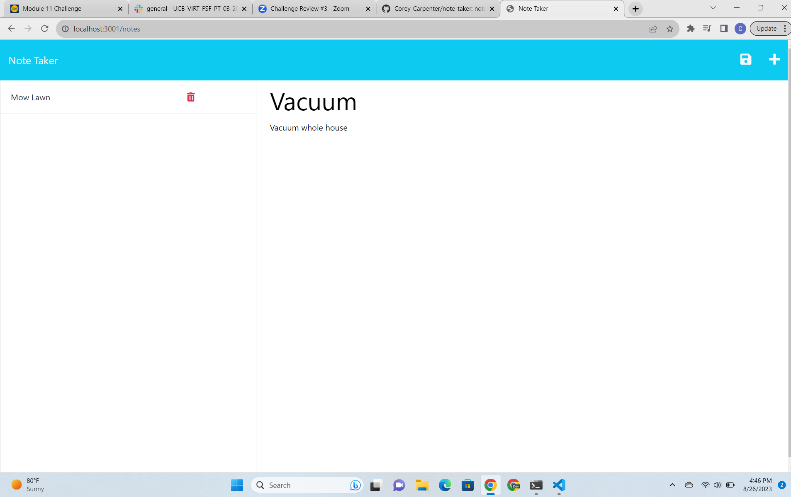

# Note Taker

## This app allows users to easily take and delete notes on the web. I built this app to help people stay organized in a convenient way. 

## To use simply open the webpage and start a new note. Put whatever title and description you'd like and then save it in the top right corner.

## For Grading team. I got a lot of my code from the homework review zoom a TA hosted. https://zoom.us/rec/share/63Vn3q91NKjMgTSvyCG_1OfFcBYK69OZrRgE964PEpK0iIIgFtT2ALWz7Fus8nbG.dMOFdchoAYYVtLIw?startTime=1690936230000 That's the link to the review session. I rearranged the code to have the same funcitonality but he covered how to do almost everything in the assignment.
